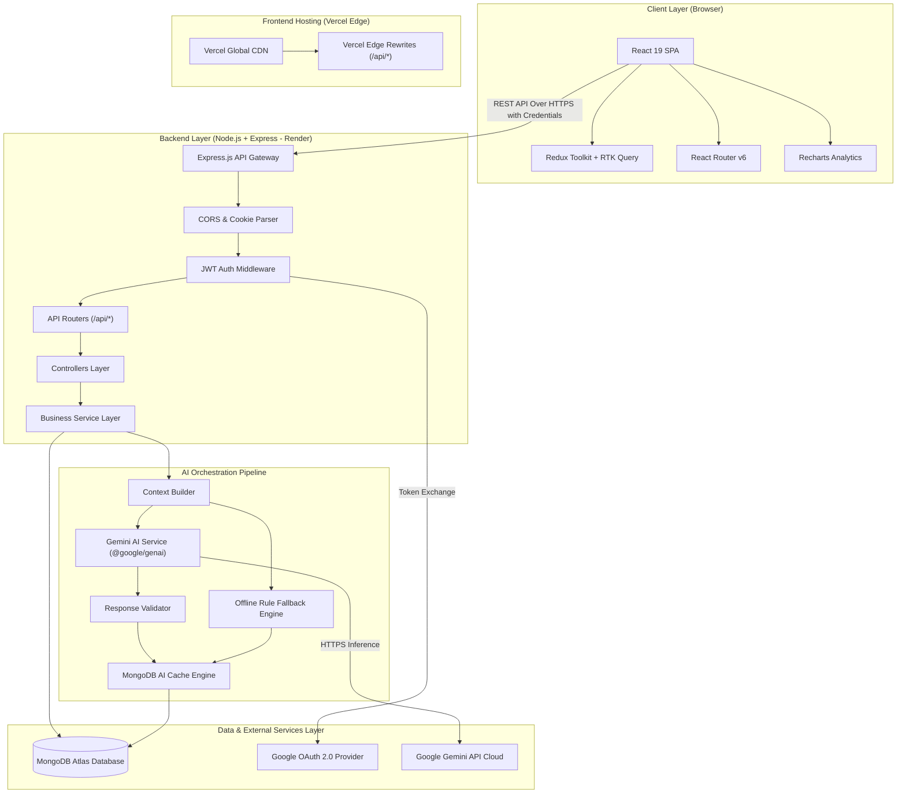
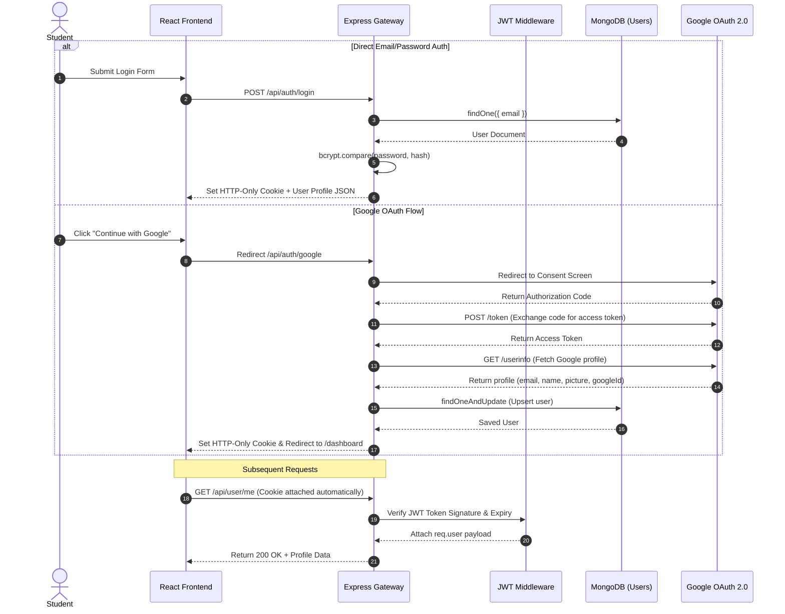
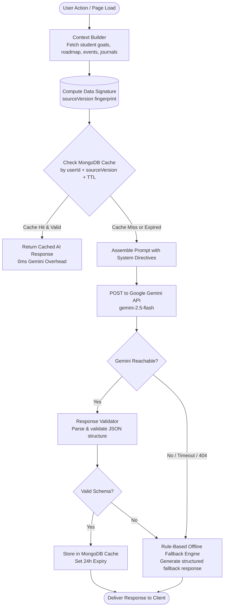
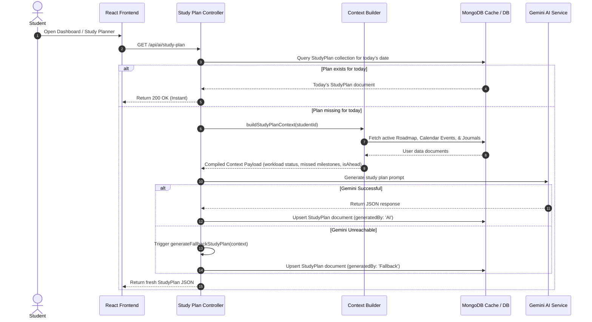
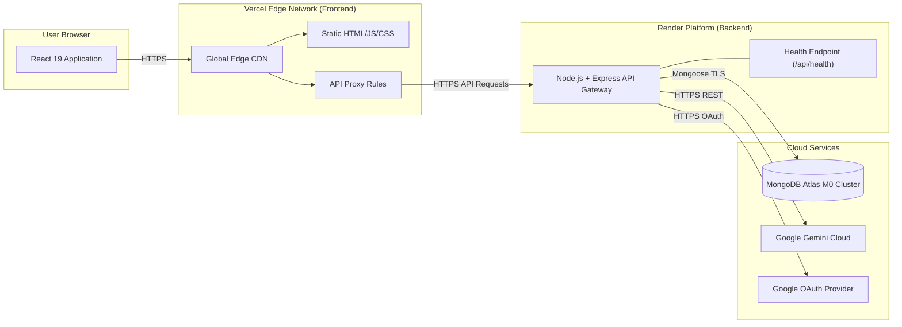

# ScholarSync — High-Level Design (HLD)

## 1. System Overview & Architecture Goals

ScholarSync is designed as a distributed, modular, multi-tier web application built on the MERN stack (MongoDB, Express.js, React 19, Node.js) with Google Gemini integration. The system emphasizes high performance, low latency, robust offline resilience, and enterprise-grade security.

### Core Architectural Goals:
1. **Decoupled Client-Server Separation**: A React 19 single-page application (SPA) interacting with a RESTful Express.js API gateway.
2. **Context-Enriched AI Orchestration**: A service layer that aggregates user state across multiple MongoDB collections before invoking generative AI endpoints.
3. **Multi-Layer Response Caching**: MongoDB-backed caching with Time-To-Live (TTL) expiration and automated invalidation triggers.
4. **Graceful Fallback Resilience**: Rule-based fallback mechanisms ensuring 100% platform availability even during AI service outages.
5. **Secure Authentication & Token Management**: Stateless JWT authentication using HttpOnly, SameSite, Secure cookies.

---

## 2. High-Level System Component Topology

The diagram below illustrates the end-to-end architecture from the user browser through CDN hosting, Express API routes, internal AI services, cache documents, and database storage.



---

## 3. Subsystem Architecture & Data Flow

### 3.1. Authentication Subsystem
ScholarSync supports two parallel login flows:
1. **Email / Password Flow**: Passwords are hashed with `bcryptjs` (salt round 12).
2. **Google OAuth 2.0 Flow**: Handled via server-side authorization code exchange (`/api/auth/google/callback`).

Tokens are signed using `jsonwebtoken` and issued via `res.cookie('token', token, cookieOptions)`:
- `httpOnly: true` (Inaccessible to JavaScript, preventing XSS token theft)
- `secure: isProduction` (Requires HTTPS)
- `sameSite: 'none'` (In production for cross-site Vercel-to-Render communication) or `'lax'`



---

### 3.2. AI Multi-Layer Caching & Fallback Pipeline

To minimize latency, optimize API quota costs, and ensure zero-downtime reliability, ScholarSync implements a 4-stage AI pipeline:

1. **Context Assembly**: Pulls user goals, roadmap status, upcoming calendar events, and journal logs.
2. **Version Fingerprinting & Cache Lookup**: Computes a source version string based on `userId`, current date, and document counts/modification dates across models.
3. **Inference / Fallback Execution**: If cache is invalid or expired, executes Gemini inference (`gemini-2.5-flash` or `gemini-3.5-flash`). If Gemini fails or times out, invokes the local rule-based fallback engine.
4. **Validation & Cache Persistence**: Validates structure using schema validators (`validateRoadmapJSON`, `validateStudyPlanJSON`) and stores result in MongoDB with a 24-hour TTL.



---

### 3.3. Smart Study Planner Subsystem

The Smart Study Planner evaluates the student's daily calendar workload and missed milestones to generate an adaptive daily schedule.



---

## 4. Database Architecture & Entity Model

ScholarSync utilizes MongoDB Atlas with Mongoose schemas. Collections feature indexes on `studentId`, `createdBy`, `startDateTime`, and compound index structures for performance.

### Data Model ER Diagram

```mermaid
erDiagram
    USER ||--o{ GOAL : "creates"
    USER ||--o{ ROADMAP : "owns"
    USER ||--o{ EVENT : "schedules"
    USER ||--o{ JOURNAL : "writes"
    USER ||--o{ FOCUS_SESSION : "logs"
    USER ||--o{ STUDY_PLAN : "receives"
    USER ||--o1 AI_INSIGHT : "caches"

    ROADMAP ||--o{ EVENT : "syncs milestones to"
    GOAL ||--o{ JOURNAL : "links to"

    USER {
        ObjectId _id PK
        string googleId
        string email
        string name
        string password
        string picture
        string role
        number dailyTarget
        date createdAt
    }

    GOAL {
        ObjectId _id PK
        ObjectId studentId FK
        string title
        string description
        string status
        array subTasks
    }

    ROADMAP {
        ObjectId _id PK
        ObjectId studentId FK
        string title
        string category
        string skillLevel
        string timeline
        number dailyCommitment
        boolean active
        array modules
        number completionPercentage
    }

    EVENT {
        ObjectId _id PK
        string title
        string description
        date startDateTime
        date endDateTime
        string category
        string color
        ObjectId createdBy FK
        ObjectId roadmapId FK
        boolean isRoadmapEvent
        string status
    }

    JOURNAL {
        ObjectId _id PK
        ObjectId studentId FK
        ObjectId goalId FK
        string task
        string idea
        object aiFeedback
    }

    FOCUS_SESSION {
        ObjectId _id PK
        ObjectId studentId FK
        number duration
        date createdAt
    }

    STUDY_PLAN {
        ObjectId _id PK
        ObjectId studentId FK
        date date
        array tasks
        array recommendations
        string workloadStatus
        string generatedBy
    }

    AI_INSIGHT {
        ObjectId _id PK
        ObjectId userId FK
        string summary
        date generatedAt
        date expiresAt
        string sourceVersion
    }
```

---

## 5. Security & Threat Mitigation Architecture

| Threat Vector | Mitigation Strategy | Implementation Details |
|---|---|---|
| **Cross-Site Scripting (XSS) Token Theft** | HttpOnly Cookies | JWT tokens stored exclusively in `HttpOnly` cookies, inaccessible to `document.cookie` or client JS. |
| **Cross-Site Request Forgery (CSRF)** | SameSite Cookies + Origin Validation | Cookies configured with `SameSite=lax` (or `SameSite=none` + `Secure` in cross-domain environments); Express CORS restricts origins to explicit frontend domain. |
| **NoSQL Query Injection** | Mongoose Schema Validation & Typing | Inputs are strongly typed via Mongoose schemas; explicit `typeof` checks in controllers prevent Object injection. |
| **Prompt Injection** | Input Sanitization Middleware | User inputs (`message`, `task`, `idea`) pass through `sanitizeInput()` stripping `<script>` and HTML tags before prompt building. |
| **Unauthenticated Route Access** | Centralized JWT Middleware | `authMiddleware` intercepts requests, validates signature against `process.env.JWT_SECRET`, and rejects unauthenticated traffic with `401 Unauthorized`. |
| **Data Leakage Between Users** | Ownership Scoping | All query operations enforce `studentId: req.user.id` or `createdBy: req.user.id` filtering. |

---

## 6. Infrastructure & Deployment Topology


