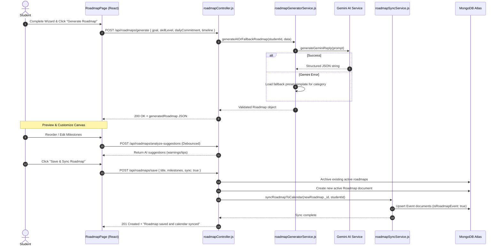
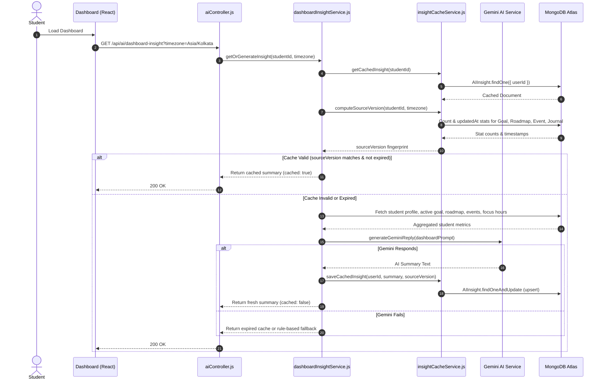

# ScholarSync — Low-Level Design (LLD)

## 1. Directory & Codebase Structure

ScholarSync follows a modular architecture separating concern layers into thin Controllers, Service & AI Pipeline Modules, Validation Engines, Mongoose Models, and React 19 Frontend Components.

```
Project-AG/
├── backend/
│   ├── index.js                      # Express App initialization, Middleware chain, Server boot
│   ├── controllers/                  # Controller layer handling HTTP requests
│   │   ├── aiController.js
│   │   ├── eventController.js
│   │   ├── roadmapController.js
│   │   └── studyPlanController.js
│   ├── middleware/                   # Express custom middleware
│   │   ├── aiService.js              # Legacy/Journal AI evaluation middleware
│   │   ├── auth.js                   # JWT cookie verification middleware
│   │   └── errorHandler.js           # Centralized global error handler
│   ├── models/                       # Mongoose database models & schemas
│   │   ├── AIInsight.js
│   │   ├── Event.js
│   │   ├── FocusSession.js
│   │   ├── Goal.js
│   │   ├── Journal.js
│   │   ├── Roadmap.js
│   │   ├── StudyPlan.js
│   │   └── User.js
│   ├── routes/                       # Express router endpoint definitions
│   │   ├── aiRoutes.js
│   │   ├── auth.js
│   │   ├── dashboard.js
│   │   ├── events.js
│   │   ├── focusSession.js
│   │   ├── goals.js
│   │   ├── journal.js
│   │   └── roadmaps.js
│   ├── services/                     # Core Business & AI Logic Subsystems
│   │   └── ai/
│   │       ├── contextBuilder.js
│   │       ├── dashboardInsightService.js
│   │       ├── geminiService.js
│   │       ├── insightCacheService.js
│   │       ├── journalContextBuilder.js
│   │       ├── promptBuilder.js
│   │       ├── roadmapGeneratorService.js
│   │       ├── roadmapSuggestionService.js
│   │       ├── roadmapSyncService.js
│   │       ├── roadmapValidator.js
│   │       ├── studyPlanContextBuilder.js
│   │       ├── studyPlanValidator.js
│   │       ├── studyPlannerService.js
│   │       └── systemPrompt.js
│   └── validation/
│       └── eventValidation.js        # Calendar input validation rules
└── frontend/                         # React 19 Client SPA (Vite + RTK Query)
```

---

## 2. Database Models & Schema Specifications

### 2.1. User Model (`backend/models/User.js`)

Stores student credentials, profile details, OAuth IDs, and daily focus target settings.

```javascript
{
  googleId: { type: String, unique: true, sparse: true },
  email:    { type: String, required: true, unique: true, lowercase: true, trim: true },
  name:     { type: String, required: true, trim: true },
  password: { type: String }, // Hashed with bcrypt (optional for Google OAuth users)
  picture:  { type: String, default: '' },
  role:     { type: String, enum: ['Student', 'Mentor'], default: 'Student' },
  domain:   { type: String },
  mentorId: { type: mongoose.Schema.Types.ObjectId, ref: 'User' },
  phone:    { type: String },
  dailyTarget: { type: Number, default: 60 }, // Daily target in minutes
  timestamps: true
}
```

### 2.2. Roadmap Model (`backend/models/Roadmap.js`)

Stores personalized learning roadmaps with embedded module subdocuments and subtask arrays.

```javascript
const taskSchema = new mongoose.Schema({
  title:       { type: String, required: true },
  description: { type: String },
  duration:    { type: String, default: '30 mins' },
  xpReward:    { type: Number, default: 50 },
  completed:   { type: Boolean, default: false },
  completedAt: { type: Date }
});

const moduleSchema = new mongoose.Schema({
  title:             { type: String, required: true },
  description:       { type: String },
  estimatedDuration: { type: String, default: '1 week' },
  status:            { type: String, enum: ['locked', 'upcoming', 'in-progress', 'completed'], default: 'locked' },
  tasks:             [taskSchema]
});

const roadmapSchema = new mongoose.Schema({
  studentId:            { type: mongoose.Schema.Types.ObjectId, ref: 'User', required: true, index: true },
  title:                { type: String, required: true },
  description:          { type: String },
  category:             { type: String, required: true },
  skillLevel:           { type: String, enum: ['Beginner', 'Intermediate', 'Advanced'], default: 'Beginner' },
  timeline:             { type: String, default: '4 weeks' },
  dailyCommitment:      { type: Number, default: 60 },
  active:               { type: Boolean, default: true },
  modules:              [moduleSchema],
  completionPercentage: { type: Number, default: 0 }
}, { timestamps: true });
```

### 2.3. Event Model (`backend/models/Event.js`)

Represents calendar events, study sessions, exams, and synchronized roadmap milestones.

```javascript
const eventSchema = new mongoose.Schema({
  title:         { type: String, required: true, trim: true },
  description:   { type: String, trim: true, default: '' },
  startDateTime: { type: Date, required: true, index: true },
  endDateTime:   { type: Date, required: true, index: true },
  category:      { type: String, trim: true, default: 'General' },
  color:         { type: String, trim: true, default: '#10B981' },
  createdBy:     { type: mongoose.Schema.Types.ObjectId, ref: 'User', required: true, index: true },
  roadmapId:     { type: mongoose.Schema.Types.ObjectId, ref: 'Roadmap', default: null },
  isRoadmapEvent: { type: Boolean, default: false },
  status:        { type: String, enum: ['upcoming', 'completed', 'cancelled'], default: 'upcoming' }
}, { timestamps: true });

// Composite Index for range queries
eventSchema.index({ createdBy: 1, startDateTime: 1, endDateTime: 1 });
```

### 2.4. StudyPlan Model (`backend/models/StudyPlan.js`)

Stores adaptive daily study schedules generated by AI or local fallback.

```javascript
const studyPlanSchema = new mongoose.Schema({
  studentId:       { type: mongoose.Schema.Types.ObjectId, ref: 'User', required: true, index: true },
  date:            { type: Date, required: true, index: true },
  tasks:           [{
    title:     { type: String, required: true },
    duration:  { type: String, required: true },
    completed: { type: Boolean, default: false }
  }],
  recommendations: [{
    message:    { type: String, required: true },
    actionType: { type: String, enum: ['reschedule', 'info'], default: 'info' },
    metadata:   { type: mongoose.Schema.Types.Mixed, default: null }
  }],
  workloadStatus:  { type: String, enum: ['Light', 'Balanced', 'Busy'], default: 'Balanced' },
  generatedBy:     { type: String, enum: ['AI', 'Fallback'], default: 'AI' }
}, { timestamps: true });

// Unique compound index: one plan per student per calendar day
studyPlanSchema.index({ studentId: 1, date: 1 }, { unique: true });
```

### 2.5. AIInsight Model (`backend/models/AIInsight.js`)

Caches generated AI dashboard insights with version signatures and TTL expiration.

```javascript
const aiInsightSchema = new mongoose.Schema({
  userId:        { type: mongoose.Schema.Types.ObjectId, ref: 'User', required: true, index: true },
  summary:       { type: String, required: true },
  generatedAt:   { type: Date, default: Date.now, required: true },
  expiresAt:     { type: Date },
  sourceVersion: { type: String }
}, { timestamps: true });
```

---

## 3. Service Layer Architecture & Functions

### 3.1. `geminiService.js`
- **Function**: `generateGeminiReply(prompt)`
- **Behavior**: Initializes `GoogleGenAI({ apiKey })`. Attempts generation with model `gemini-2.5-flash`. If model fails or returns 404, automatically catches and retries with `gemini-3.5-flash`.

### 3.2. `contextBuilder.js`
- **Function**: `buildContext(studentId)`
- **Behavior**: Uses `Promise.all()` to pull active Goal, active Roadmap, upcoming 10 Event candidates, and 3 recent Journal entries via `buildJournalContext()`. Formats aggregated data into a structured string appended to system prompt.

### 3.3. `dashboardInsightService.js`
- **Function**: `getOrGenerateInsight(studentId, clientTimezone)`
- **Behavior**:
  1. Calls `getCachedInsight(studentId)` and `computeSourceVersion(studentId, clientTimezone)`.
  2. If `isCacheValid(cachedInsight, sourceVersion)` returns `true`, returns cached summary instantly (`cached: true`).
  3. If invalid/missing, fetches student goals, roadmap, events, focus session totals, level/XP, builds prompt, and queries Gemini.
  4. Upserts new insight via `saveCachedInsight()` and returns. If Gemini fails, returns expired cache or friendly fallback.

### 3.4. `studyPlannerService.js`
- **Function**: `getOrCreateDailyStudyPlan(studentId, forceRegenerate)`
- **Behavior**: Checks `StudyPlan` collection for normalized today's date (`00:00:00.000`). If missing or `forceRegenerate === true`, compiles `buildStudyPlanContext()`, queries Gemini, parses response via `validateStudyPlanJSON()`, and saves. If Gemini fails, invokes `generateFallbackStudyPlan()`.

### 3.5. `roadmapSyncService.js`
- **Function**: `syncRoadmapToCalendar(roadmapId, studentId)`
- **Behavior**: Fetches active roadmap modules and existing calendar events where `isRoadmapEvent === true`. Calculates module durations in days and updates existing event dates/titles or creates new events. Deletes trailing events if module count decreased.

---

## 4. Detailed Sequence Diagrams

### 4.1. AI Roadmap Generation, Preview Editing, and Calendar Sync



---

### 4.2. AI Dashboard Insight Generation & Cache Lifecycle



---

## 5. API Endpoint Contracts

### 5.1. Authentication Routes (`/api/auth`)

#### `POST /api/auth/signup`
- **Auth**: None
- **Request Body**:
  ```json
  {
    "name": "Jane Doe",
    "email": "jane@example.com",
    "password": "Password123!",
    "phone": "+1234567890"
  }
  ```
- **Success Response (201 Created)**:
  - **Headers**: `Set-Cookie: token=<jwt>; HttpOnly; Secure; SameSite=none`
  - **Body**:
    ```json
    {
      "user": {
        "_id": "66b1...",
        "name": "Jane Doe",
        "email": "jane@example.com",
        "picture": "",
        "phone": "+1234567890"
      }
    }
    ```

#### `POST /api/auth/login`
- **Auth**: None
- **Request Body**:
  ```json
  {
    "email": "jane@example.com",
    "password": "Password123!",
    "remember": true
  }
  ```
- **Success Response (200 OK)**:
  - **Headers**: `Set-Cookie: token=<jwt>; HttpOnly; Secure; SameSite=none; Max-Age=2592000`
  - **Body**:
    ```json
    {
      "user": {
        "_id": "66b1...",
        "name": "Jane Doe",
        "email": "jane@example.com",
        "picture": ""
      }
    }
    ```

---

### 5.2. AI Routes (`/api/ai`)

#### `POST /api/ai/chat`
- **Auth**: Required (JWT Cookie)
- **Request Body**:
  ```json
  {
    "message": "Explain binary search trees with an analogy."
  }
  ```
- **Success Response (200 OK)**:
  ```json
  {
    "success": true,
    "reply": "Think of a Binary Search Tree like a organized library catalog..."
  }
  ```

#### `GET /api/ai/dashboard-insight`
- **Auth**: Required (JWT Cookie)
- **Query Params**: `timezone=Asia/Kolkata`
- **Success Response (200 OK)**:
  ```json
  {
    "success": true,
    "cached": true,
    "summary": "You've maintained a 5-day streak! Focus on completing Module 2 of your MERN roadmap today.",
    "generatedAt": "2026-08-05T12:00:00.000Z",
    "expiresAt": "2026-08-06T12:00:00.000Z"
  }
  ```

#### `GET /api/ai/study-plan`
- **Auth**: Required (JWT Cookie)
- **Query Params**: `date=2026-08-05` (Optional)
- **Success Response (200 OK)**:
  ```json
  {
    "success": true,
    "data": {
      "_id": "66b2...",
      "date": "2026-08-05T00:00:00.000Z",
      "workloadStatus": "Balanced",
      "generatedBy": "AI",
      "tasks": [
        {
          "_id": "66b3...",
          "title": "ES6 Destructuring Practice",
          "duration": "45 min",
          "completed": false
        }
      ],
      "recommendations": []
    }
  }
  ```

---

### 5.3. Calendar Event Routes (`/api/events`)

#### `GET /api/events`
- **Auth**: Required (JWT Cookie)
- **Query Params**: `start=2026-08-01T00:00:00Z&end=2026-08-31T23:59:59Z`
- **Success Response (200 OK)**:
  ```json
  {
    "success": true,
    "count": 12,
    "data": [
      {
        "_id": "66b4...",
        "title": "Module 1: Foundations",
        "startDateTime": "2026-08-05T09:00:00.000Z",
        "endDateTime": "2026-08-05T18:00:00.000Z",
        "category": "Study",
        "color": "#8B5CF6",
        "createdBy": "66b1...",
        "isRoadmapEvent": true,
        "status": "upcoming"
      }
    ]
  }
  ```

#### `POST /api/events`
- **Auth**: Required (JWT Cookie)
- **Request Body**:
  ```json
  {
    "title": "DSA Mock Interview",
    "description": "Practice binary trees with peer",
    "startDateTime": "2026-08-06T14:00:00.000Z",
    "endDateTime": "2026-08-06T15:00:00.000Z",
    "category": "Interview",
    "color": "#10B981"
  }
  ```
- **Success Response (201 Created)**:
  ```json
  {
    "success": true,
    "message": "Event created successfully",
    "data": { ... }
  }
  ```

---

## 6. Error Handling & Exception Taxonomy

All errors bubble up to the centralized error handler (`backend/middleware/errorHandler.js`).

```json
{
  "success": false,
  "message": "Human-readable error explanation"
}
```

### Standard Status Codes Mapping:
- `400 Bad Request`: Input validation failure, invalid date formats, empty prompt messages.
- `401 Unauthorized`: Missing, invalid, or expired JWT cookie.
- `403 Forbidden`: Attempting to read/modify resources created by another user (`req.user.id !== resource.createdBy`).
- `404 Not Found`: Target document (Roadmap, Event, StudyPlan) does not exist.
- `409 Conflict`: Attempting to sign up with an existing email address.
- `500 Internal Server Error`: Unhandled database runtime exceptions, external SDK network errors.
