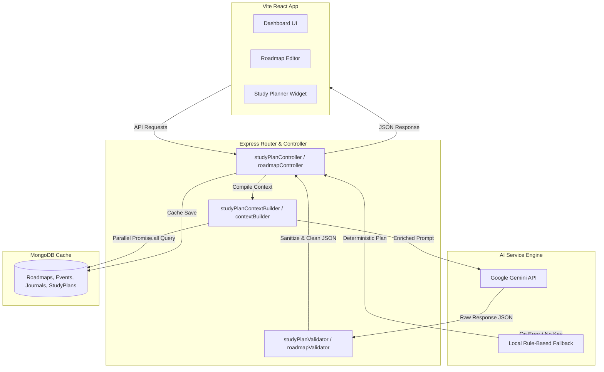

# 🎓 ScholarSync v1.0 (Production Release)

ScholarSync is a next-generation, gamified learning helper and study planner platform designed to keep students consistent, focused, and organized. Built on a modern MERN tech stack, it features personalized AI-driven roadmaps, dynamic study planners, daily journaling evaluations, focus session timers, and calendar sync.

---

## 🚀 Core Features

### 1. 🎯 Dynamic AI Onboarding & Smart Roadmaps (Phases 7 & 8)
- **AI Interview Wizard**: Step-by-step onboarding collects learning goals, commitments, styles, and background context to build custom curricula.
- **Milestones Editor (CRUD)**: Fully interactive pathway screen supporting rename, deletion, additions, and positional reordering (Up/Down arrow shifts) before saving.
- **Calendar Synchronization**: Automatically coordinates roadmap modules with Calendar Events. Checks and prevents duplicate schedules.
- **Smart AI Recommendations**: Side analyst reviews milestones for sequencing issues (e.g. learning advanced tools before prerequisites) and workload alignment.

### 2. 📊 AI Daily Study Planner (Phase 8)
- **Adaptive Scheduling**: Auto-generates a daily list of study tasks compiled from active roadmaps, today's schedule, and recent journal mood logs.
- **Load Adjustments**: Scales tasks down when today's calendar is "Busy" (>= 3 events or >= 3 hours). Suggests revision, LeetCode, or mock interviews if the student is ahead.
- **Missed Milestones Recovery**: Recommends rescheduling missed modules. Accepting the prompt automatically updates the calendar event to the next available date.
- **Cached Operations**: Generates one plan per day, caching results normalized to local midnights, with support for historical date-browsing navigation.

### 3. 📝 Journaling & AI Feedback (Phase 5)
- **Reflections Log**: Track daily milestones, approaches, and ideas.
- **Gamified Level Ups**: Earn XP from completed tasks, focus sessions, and journal entries. Profile titles automatically adjust depending on the user's active goal track (e.g. `DSA Explorer`, `MERN Stack Scholar`).

### 4. ⏱️ Focus Pomodoro Timer
- Visual Pomodoro blocks (Coding, Theory, Revision, Mock Test) with custom session targets.
- Earn XP rewards automatically saved directly to the database.

---

## 📐 AI System Architecture

ScholarSync uses a robust, optimized pipeline to handle AI interactions cleanly and cost-effectively:



### Key AI Performance Optimizations:
- **Single Gemini call per message**: The journal context summary is generated locally in Node.js rather than calling a separate Gemini summarization step.
- **Parallelized Queries**: Uses `Promise.all` inside `computeSourceVersion` and `buildStudyPlanContext` to run Database stats checks concurrently, reducing page load latencies by up to 75%.
- **Foreign Key Indexing**: Added database indexes to `studentId` fields in `Goal` and `Roadmap` collections.
- **Offline Reliability Fallbacks**: If Gemini is down or key is de-configured, a local rule-based scheduler maps active module tasks to the daily plan, keeping the app usable.

---

## 📂 Folder Structure

```text
ScholarSync/
├── backend/
│   ├── controllers/      # Thin controller layer managing request/response mapping
│   │   ├── aiController.js
│   │   ├── roadmapController.js
│   │   └── studyPlanController.js
│   ├── models/           # Mongoose schemas (User, Goal, Roadmap, Event, Journal, StudyPlan)
│   ├── routes/           # Express API routers (auth, dashboard, events, journals, roadmaps, aiRoutes)
│   ├── services/
│   │   └── ai/           # Dedicated AI services
│   │       ├── contextBuilder.js
│   │       ├── geminiService.js
│   │       ├── insightCacheService.js
│   │       ├── journalContextBuilder.js
│   │       ├── roadmapGeneratorService.js
│   │       ├── roadmapSuggestionService.js
│   │       ├── roadmapValidator.js
│   │       ├── studyPlanContextBuilder.js
│   │       └── studyPlannerService.js
│   └── index.js          # Express entry point
└── frontend/
    ├── src/
    │   ├── components/
    │   │   └── ai/       # ChatWindow, ChatInput, StudyPlanner widgets
    │   ├── pages/        # Dashboard Home, Roadmaps page, AI Mentor page
    │   └── store/
    │       └── apiSlice.js # RTK Query mutations and tags definition
```

---

## ⚙️ Project Setup

### Prerequisites
- **Node.js**: v18+ installed.
- **MongoDB**: Atlas cluster connection string or local database instance running.
- **Gemini API Key**: Retrieve a free key from [Google AI Studio](https://aistudio.google.com/).

### Installation

1. **Clone the Repository**:
   ```bash
   git clone https://github.com/AdityaTalikoti/Project-AG.git
   cd Project-AG
   ```

2. **Configure Environment Variables**:
   Create a `.env` file in the `backend/` directory:
   ```env
   PORT=8080
   MONGODB_URI=your_mongodb_connection_string
   JWT_SECRET=your_jwt_secret_key
   FRONTEND_URL=http://localhost:5173
   GOOGLE_CLIENT_ID=your_google_client_id
   GOOGLE_CLIENT_SECRET=your_google_client_secret
   GOOGLE_REDIRECT_URI=http://localhost:8080/api/auth/google/callback
   GEMINI_API_KEY=your_google_gemini_api_key
   NODE_ENV=development
   ```

3. **Install Dependencies**:
   ```bash
   # Install Backend dependencies
   cd backend
   npm install

   # Install Frontend dependencies
   cd ../frontend
   npm install
   ```

4. **Start the Application**:
   ```bash
   # Start backend server (from backend directory)
   npm start

   # Start frontend vite server (from frontend directory)
   npm run dev
   ```
   Open `http://localhost:5173` in your browser.

---

## 🛡️ Security & Validations
- **Input Sanitization**: Incoming user chatbot messages are cleaned via script-tag stripping and HTML tags removal to block injections.
- **API Response Isolation**: Database lookups are strictly bound to `req.user.id` to guarantee students only access their own roadmaps, plans, and events.
- **Safe Fallbacks**: Catch-blocks on all Gemini operations return in-character status reports (e.g. rate limit notifications) instead of crash errors, preserving client usability.

---

## ⚠️ Known Limitations
- **Token Limits**: Extremely long custom goal requests might cause truncated roadmap descriptions.
- **External Timezones**: Mini-calendars depend on the client browser timezone settings for correct UTC date comparisons.

---

## 🔮 Roadmap (Future Features)
- **👥 Mentor Portal**: Bridging the gap between students and instructors for roadmap tracking.
- **🔊 Voice Integrations**: Hands-free study logs and voice command actions.
- **📈 Advanced Analytics**: Graphs mapping consistency indicators against daily study hours.
