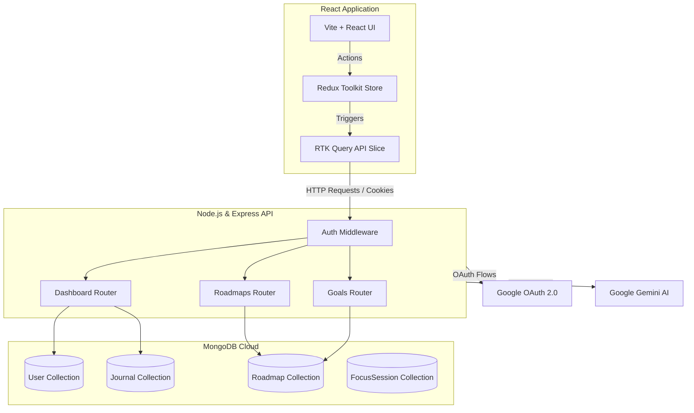
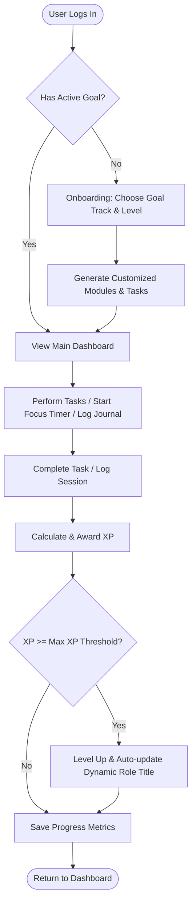

# 🎓 ScholarSync

ScholarSync is a next-generation, gamified learning helper and analytics platform designed to keep students consistent, focused, and organized. Built on a modern tech stack, it features interactive learning roadmaps, consistency analytics (Consistency vs. Depth), focus session timers, and a daily journaling tracker.

---

## 🚀 Key Features

### 1. 🎯 Dynamic Learning Roadmaps
- **Personalized Onboarding**: Select goal tracks (MERN Stack, DSA, AI/ML, React, Placement Prep) and experience level (Beginner, Intermediate, Advanced) to generate customized pathways.
- **Track Progress**: Gain XP for completing modular tasks, update status dynamically, and visualize progress.

### 2. 📊 Gamified Profile & Level Up System
- **Real-Time Levelling**: Earn XP dynamically from completed tasks, focus sessions, and journal entries.
- **Dynamic Titles**: Profile level names adjust automatically according to the user's active goal track (e.g. `MERN Stack Mastery Explorer`, `DSA Scholar`).

### 3. ⏱️ Focus Timer (Pomodoro Blocks)
- Visual work/break session timers with custom session targets.
- Categorization of study blocks (e.g., Coding, Theory, Revision, Mock Test).
- Automated XP rewards saved directly to the database upon focus completions.

### 4. 📝 Daily Journaling
- Daily logs to record accomplishments, goals, and tasks.
- Consistency tracking utilizing custom AI-assisted feedback hooks.

### 5. 🔐 Secure Authentication & Session Settings
- Dual login pathways: Email/Password signup and Google OAuth callback integrations.
- Secure, HTTP-only JWT cookies for persistent and safe authentication.

---

## 🔮 Upcoming Features

*   **👥 Mentor Portal**: Bridging the gap between students and instructors. Allows mentors to assign tasks, monitor learning roadmaps, and write performance feedbacks.
*   **🤖 Gemini AI Integration**: Empowering ScholarSync with Google Gemini to analyze study consistency, auto-grade journal tasks, generate adaptive roadmap modules, and provide personalized flashcard decks.
*   **📝 Notes Management**: A clean, markdown-supported rich-text editor for logging concepts and notes inline with roadmaps.
*   **📋 Interactive Tasks Board**: A kanban-style project board to organize personal assignments and syllabus deadlines.
*   **🎴 Gamified Flashcards**: AI-generated smart flashcard decks leveraging spaced repetition algorithms for quick memory recalls.

---

## 📐 System Architecture & Flow

### System Architecture
The diagram below illustrates how the React frontend, Express/Node backend, MongoDB, and external services interact:



### Roadmap & XP Gamification Engine
The flowchart below details the logic loop from goal selection to gaining XP and leveling up:



---

## 🛠️ Tech Stack

*   **Frontend**: React (Vite), Redux Toolkit (RTK Query), TailwindCSS, Recharts, Lucide Icons, React Router DOM.
*   **Backend**: Node.js, Express.js, JSON Web Tokens (JWT), Axios, Cookie Parser.
*   **Database**: MongoDB (Mongoose Schemas).
*   **Authentication**: Google OAuth 2.0, bcryptjs.

---

## ⚙️ Project Setup

### Prerequisites
- Node.js (v18+)
- MongoDB Atlas account (or local MongoDB database)
- Google Cloud Console Project (for Google OAuth credentials)

### Installation

1. **Clone the Repository**:
   ```bash
   git clone https://github.com/AdityaTalikoti/Project-AG.git
   cd Project-AG
   ```

2. **Configure Environment Variables**:
   Create a `.env` file in the `backend/` directory:
   ```env
   PORT=8080
   MONGO_URI=your_mongodb_connection_string
   JWT_SECRET=your_jwt_secret_key
   FRONTEND_URL=http://localhost:5174
   GOOGLE_CLIENT_ID=your_google_client_id
   GOOGLE_CLIENT_SECRET=your_google_client_secret
   GOOGLE_REDIRECT_URI=http://localhost:8080/api/auth/google/callback
   NODE_ENV=development
   ```

3. **Install Dependencies**:
   ```bash
   # Install Backend dependencies
   cd backend
   npm install

   # Install Frontend dependencies
   cd ../frontend
   npm install
   ```

4. **Start the Application**:
   ```bash
   # Run Backend (from backend directory)
   npm start

   # Run Frontend (from frontend directory)
   npm run dev
   ```
   Open `http://localhost:5174` in your browser.
