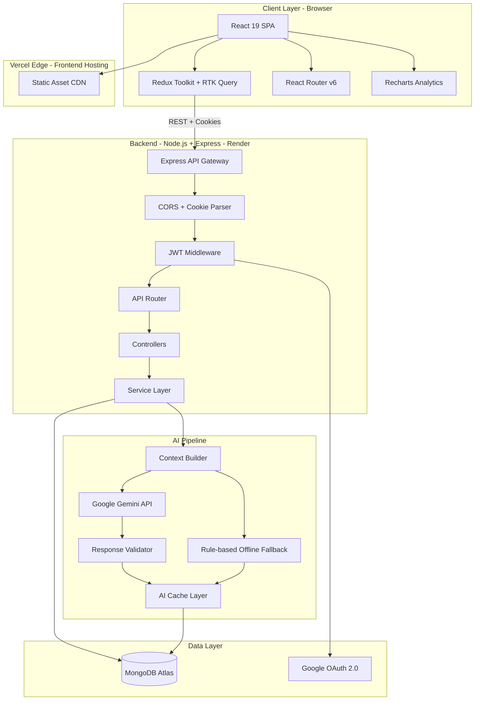
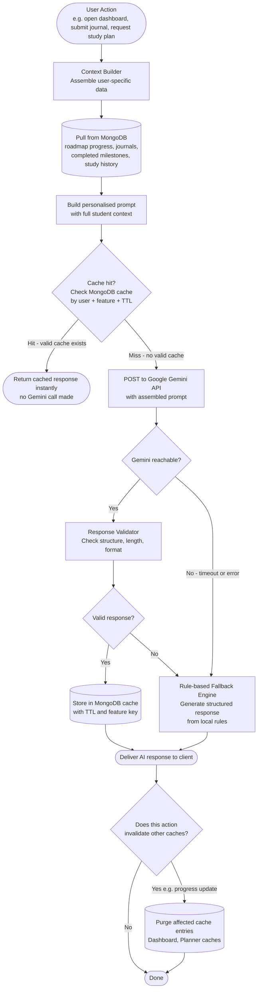
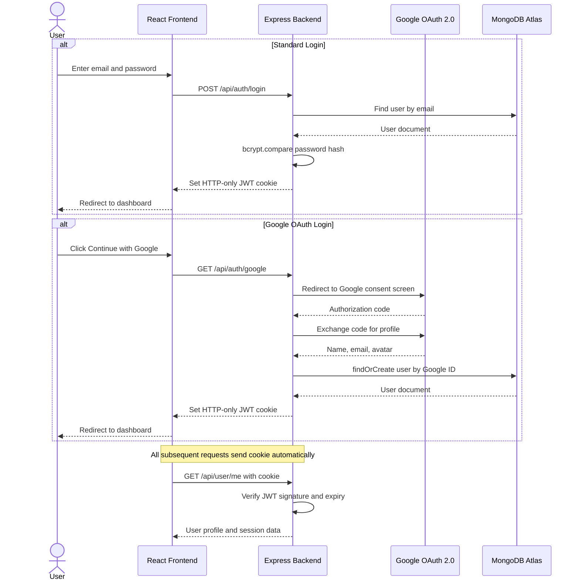
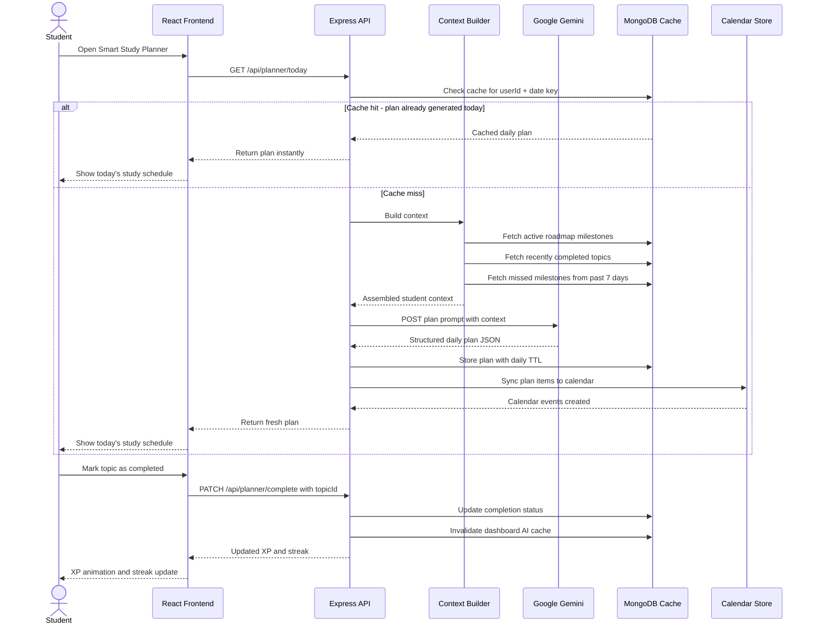
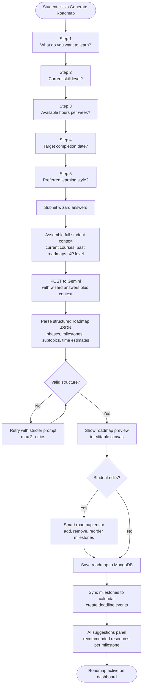
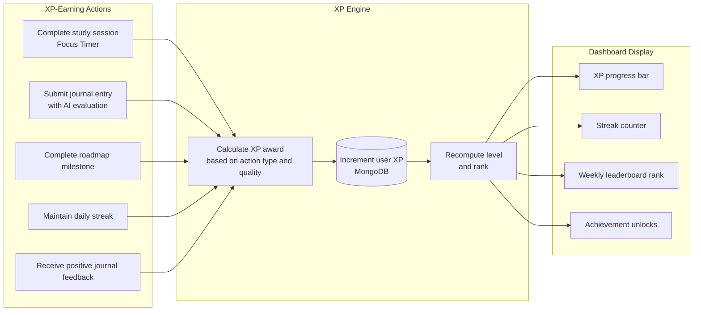
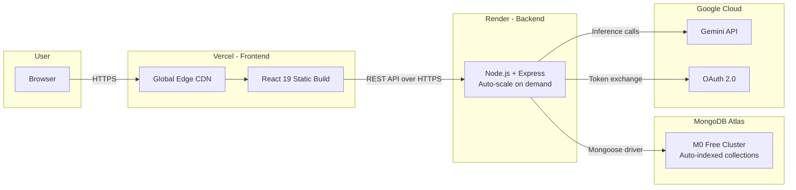

<div align="center">

<!--  -->

<br/><br/>

<h1>ScholarSync</h1>

<p><strong>AI-powered student productivity platform — personalised learning roadmaps, intelligent mentoring,<br/>smart study planning, journal evaluation, and real-time analytics. Built for consistency. Powered by Gemini.</strong></p>

<br/>

<a href="https://scholar-sync-brown.vercel.app/" target="_blank">
  
</a>
&nbsp;
<a href="https://scholar-sync-backend-6f31.onrender.com/api/health" target="_blank">
  
</a>

<br/><br/>


<br/><br/>

</div>

---

## Table of Contents

- [Overview](#overview)
- [Live Demo](#live-demo)
- [System Architecture](#system-architecture)
- [AI Architecture and Caching Pipeline](#ai-architecture-and-caching-pipeline)
- [Authentication Flow](#authentication-flow)
- [Data Flow — Study Planner](#data-flow--study-planner)
- [Roadmap Generator Pipeline](#roadmap-generator-pipeline)
- [XP and Gamification System](#xp-and-gamification-system)
- [Deployment Topology](#deployment-topology)
- [Features](#features)
- [Tech Stack](#tech-stack)
- [Project Structure](#project-structure)
- [Environment Configuration](#environment-configuration)
- [Getting Started](#getting-started)
- [API Reference](#api-reference)
- [Production Optimisations](#production-optimisations)
- [Security Model](#security-model)
- [Development Timeline](#development-timeline)
- [Roadmap](#roadmap)
- [Author](#author)
- [License](#license)

---

## Overview

ScholarSync is a production-deployed AI-powered productivity platform built specifically for students. It solves a problem that general-purpose productivity tools do not — students need more than task lists and calendars. They need a system that understands their learning goals, generates structured roadmaps to reach them, plans their daily study schedule intelligently, evaluates their reflection and journaling, and provides a mentor they can ask anything, anytime.

The platform is built on a MERN stack with Google Gemini as the AI backbone. Rather than making a raw Gemini call on every user interaction, ScholarSync implements a multi-layer AI architecture: a context builder that assembles user-specific data before every prompt, a validation layer that ensures AI responses are structured and usable, a MongoDB-backed cache layer that avoids redundant inference calls, and a rule-based offline fallback engine that keeps the platform functional when Gemini is unreachable.

Key design decisions:

- **Context-first AI**: Every Gemini call is preceded by a context builder that pulls the student's current roadmap progress, completed milestones, recent journal entries, and study history. This makes responses feel personalised rather than generic.
- **Aggressive caching**: Dashboard insights, study plans, and roadmap suggestions are cached in MongoDB with TTL-based invalidation. A student refreshing their dashboard 10 times in an hour makes one Gemini call, not ten.
- **Graceful degradation**: A rule-based fallback engine handles all AI features when Gemini is unreachable — the platform never shows an error page for AI failures.
- **Parallel DB queries**: All dashboard data is fetched with `Promise.all()` to eliminate serial query latency.
- **HTTP-only JWT cookies**: Tokens are never accessible to JavaScript, eliminating XSS-based token theft entirely.

---

## Live Demo

| Service | URL |
|---|---|
| Frontend | [scholar-sync-brown.vercel.app](https://scholar-sync-brown.vercel.app/) |
| Backend Health | [scholar-sync-backend-6f31.onrender.com/api/health](https://scholar-sync-backend-6f31.onrender.com/api/health) |

---

## System Architecture

The full component topology of ScholarSync — from browser through the API, AI pipeline, and data layer.



---

## AI Architecture and Caching Pipeline

How ScholarSync manages AI calls to stay fast, cost-efficient, and resilient — with context injection, response caching, and offline fallback.



---

## Authentication Flow

ScholarSync supports both standard email/password authentication and Google OAuth 2.0. Tokens are issued as HTTP-only cookies, never exposed to JavaScript.



---

## Data Flow — Study Planner

How the AI Smart Study Planner generates, caches, and reschedules a student's daily study plan — including missed milestone recovery.



---

## Roadmap Generator Pipeline

The multi-step interview wizard that generates a personalised learning roadmap using AI.



---

## XP and Gamification System

How XP is earned, tracked, and displayed across features.



---

## Deployment Topology



---

## Features

### AI Mentor

A context-aware chatbot that answers any academic question with full knowledge of the student's current roadmap, recent progress, and learning goals. Every message to the mentor includes a dynamically assembled context payload — responses are tailored to where the student actually is, not generic answers to generic questions.

- Personalised guidance based on current roadmap and XP level
- Secure prompt handling with input sanitisation
- Offline fallback with rule-based responses when Gemini is unavailable

### AI Roadmap Generator

A multi-step interview wizard that generates a complete, phase-by-phase learning roadmap — not a flat list of topics, but a structured plan with milestones, subtopics, estimated hours, and target dates.

- Five-step wizard collects goals, skill level, availability, and learning style
- AI-generated roadmap rendered in an editable canvas
- Milestone-level calendar synchronisation
- AI suggestions panel with recommended resources per milestone

### AI Dashboard Intelligence

The dashboard surfaces personalised insights based on the student's actual data — not static motivational quotes, but specific observations about pace, missed milestones, and areas gaining momentum.

- Cached responses to avoid redundant Gemini calls on every page load
- Automatic cache invalidation when progress is updated
- Parallel database queries for fast dashboard load time

### AI Smart Study Planner

Generates a daily study schedule that accounts for active roadmap milestones, recent completions, missed topics from the past week, and the student's available hours — updated each day.

- Daily cache keyed by user ID and date
- Missed milestone recovery integrated into next-day plan
- Calendar rescheduling when a session is skipped
- Workload balancing across subjects

### Journal Evaluation

Students write reflective journal entries and receive structured AI feedback — quality scores, specific observations, and actionable suggestions for deeper reflection. Consistent journaling earns XP rewards.

- AI feedback on clarity, depth, and self-awareness
- Reflection tracking across entries over time
- XP rewards for quality submissions

### Focus Timer

A Pomodoro-style session timer that tracks study sessions, awards XP on completion, and contributes to the student's streak and weekly analytics.

- Configurable session and break durations
- XP tracking per completed session
- Session history visible in analytics dashboard

---

## Tech Stack

### Frontend

| Technology | Version | Purpose |
|---|---|---|
| React | 19 | UI component library, concurrent rendering |
| Vite | Latest | Build tool, HMR dev server |
| Redux Toolkit + RTK Query | Latest | Global state, API caching, request deduplication |
| React Router | v6 | Client-side routing, protected routes |
| Tailwind CSS | Latest | Utility-first styling |
| Recharts | Latest | Analytics charts and progress visualisation |
| Lucide React | Latest | Icon library |

### Backend

| Technology | Version | Purpose |
|---|---|---|
| Node.js | Latest LTS | JavaScript runtime |
| Express.js | Latest | REST API framework |
| MongoDB Atlas | Latest | Cloud-hosted NoSQL document database |
| Mongoose | Latest | ODM, schema validation, query builder |
| JWT | Latest | Stateless authentication tokens |
| Google OAuth 2.0 | Latest | Social login provider |
| bcrypt | Latest | Password hashing |

### AI

| Technology | Purpose |
|---|---|
| Google Gemini | Primary AI inference engine |
| Context Builder | Assembles personalised user data before every Gemini call |
| AI Cache Layer | MongoDB-backed response cache with TTL and feature-key invalidation |
| Rule-based Fallback | Offline engine that handles all AI features without Gemini |
| Response Validator | Validates Gemini output structure before serving to client |

### Deployment

| Layer | Platform | Notes |
|---|---|---|
| Frontend | Vercel | Auto-deploy on push to main, global edge CDN |
| Backend | Render | Auto-scaling Node.js service, health endpoint |
| Database | MongoDB Atlas | M0 free cluster, auto-indexed collections |

---

## Project Structure

```
Project-AG/
|
+-- backend/
|   +-- controllers/             # Route handler functions — thin, delegate to services
|   |   +-- authController.js
|   |   +-- roadmapController.js
|   |   +-- plannerController.js
|   |   +-- journalController.js
|   |   +-- mentorController.js
|   |   +-- dashboardController.js
|   +-- middleware/
|   |   +-- authMiddleware.js    # JWT verification, attach user to req
|   |   +-- errorMiddleware.js   # Centralised error handler
|   +-- models/                  # Mongoose schemas
|   |   +-- User.js
|   |   +-- Roadmap.js
|   |   +-- StudyPlan.js
|   |   +-- Journal.js
|   |   +-- AICache.js           # Cache document with TTL and feature key
|   |   +-- FocusSession.js
|   +-- routes/                  # Express Router definitions
|   |   +-- auth.js
|   |   +-- roadmap.js
|   |   +-- planner.js
|   |   +-- journal.js
|   |   +-- mentor.js
|   |   +-- dashboard.js
|   +-- services/                # Business logic layer
|   |   +-- aiService.js         # Gemini call, cache check, fallback orchestration
|   |   +-- contextBuilder.js    # Assembles user context before every AI call
|   |   +-- cacheService.js      # MongoDB cache read, write, invalidate, TTL management
|   |   +-- fallbackEngine.js    # Rule-based offline response generator
|   |   +-- calendarService.js   # Calendar event creation and sync
|   +-- index.js                 # Express app setup, middleware chain, server start
|
+-- frontend/
|   +-- src/
|   |   +-- components/          # Reusable UI components
|   |   |   +-- Roadmap/         # RoadmapCanvas, MilestoneCard, SuggestionsPanel
|   |   |   +-- Planner/         # DailyPlanView, SessionTimer, ProgressBar
|   |   |   +-- Journal/         # JournalEditor, FeedbackCard, HistoryList
|   |   |   +-- Mentor/          # ChatWindow, MessageBubble, ContextIndicator
|   |   |   +-- Dashboard/       # InsightsPanel, XPBar, StreakBadge, Analytics
|   |   |   +-- Timer/           # PomodoroTimer, SessionControls
|   |   +-- pages/               # Route-level page components
|   |   |   +-- Dashboard.jsx
|   |   |   +-- Roadmap.jsx
|   |   |   +-- Planner.jsx
|   |   |   +-- Journal.jsx
|   |   |   +-- Mentor.jsx
|   |   |   +-- Login.jsx
|   |   +-- store/               # Redux slices and RTK Query API definitions
|   |   |   +-- authSlice.js
|   |   |   +-- roadmapApi.js
|   |   |   +-- plannerApi.js
|   |   |   +-- journalApi.js
|   |   +-- assets/              # Images, fonts, icons
|   +-- index.html
|   +-- vite.config.js
|
+-- .gitignore
+-- package.json
+-- README.md
```

---

## Environment Configuration

```env
# ── Database ───────────────────────────────────────────────────────────────────
MONGODB_URI=mongodb+srv://<user>:<password>@cluster.mongodb.net/scholarsync

# ── Authentication ─────────────────────────────────────────────────────────────
JWT_SECRET=your-minimum-64-character-secret-key
JWT_EXPIRE=7d

# ── Google AI ──────────────────────────────────────────────────────────────────
GEMINI_API_KEY=your-gemini-api-key

# ── Google OAuth 2.0 ───────────────────────────────────────────────────────────
GOOGLE_CLIENT_ID=your-google-client-id
GOOGLE_CLIENT_SECRET=your-google-client-secret
GOOGLE_REDIRECT_URI=http://localhost:5000/api/auth/google/callback

# ── App ────────────────────────────────────────────────────────────────────────
FRONTEND_URL=http://localhost:5173
NODE_ENV=development
PORT=5000
```

---

## Getting Started

```bash
# Clone the repository
git clone https://github.com/AdityaTalikoti/Project-AG.git
cd Project-AG

# Install backend dependencies
cd backend
npm install
cp .env.example .env
# Fill in all values in .env

# Start backend
npm run dev

# In a new terminal — install frontend dependencies
cd ../frontend
npm install
npm run dev
```

| Service | URL |
|---|---|
| Frontend | http://localhost:5173 |
| Backend API | http://localhost:5000 |
| Health Check | http://localhost:5000/api/health |

---

## API Reference

All endpoints are prefixed with `/api`. Protected routes require a valid JWT cookie set on login.

### Authentication

| Method | Endpoint | Auth | Description |
|---|---|---|---|
| `POST` | `/api/auth/register` | No | Register with email and password |
| `POST` | `/api/auth/login` | No | Login, sets HTTP-only JWT cookie |
| `GET` | `/api/auth/google` | No | Initiate Google OAuth flow |
| `GET` | `/api/auth/google/callback` | No | OAuth callback, sets JWT cookie |
| `POST` | `/api/auth/logout` | Yes | Clear JWT cookie |
| `GET` | `/api/auth/me` | Yes | Get current user profile |

### Roadmap

| Method | Endpoint | Auth | Description |
|---|---|---|---|
| `POST` | `/api/roadmap/generate` | Yes | Generate AI roadmap from wizard answers |
| `GET` | `/api/roadmap` | Yes | Get active roadmap |
| `PATCH` | `/api/roadmap/milestone/:id` | Yes | Mark milestone as complete |
| `PUT` | `/api/roadmap` | Yes | Update roadmap structure after editing |

### Study Planner

| Method | Endpoint | Auth | Description |
|---|---|---|---|
| `GET` | `/api/planner/today` | Yes | Get or generate today's study plan |
| `PATCH` | `/api/planner/complete` | Yes | Mark a study topic as completed |
| `GET` | `/api/planner/history` | Yes | Past study plans |

### Journal

| Method | Endpoint | Auth | Description |
|---|---|---|---|
| `POST` | `/api/journal` | Yes | Submit journal entry, triggers AI evaluation |
| `GET` | `/api/journal` | Yes | List all journal entries |
| `GET` | `/api/journal/:id` | Yes | Get single entry with AI feedback |

### Mentor Portal(Upcoming)

| Method | Endpoint | Auth | Description |
|---|---|---|---|
| `POST` | `/api/mentor/chat` | Yes | Send message, receive contextualised AI response |
| `GET` | `/api/mentor/history` | Yes | Retrieve past chat messages |

### Dashboard

| Method | Endpoint | Auth | Description |
|---|---|---|---|
| `GET` | `/api/dashboard` | Yes | Full dashboard data — insights, XP, streak, analytics |

---

## Production Optimisations

- **Parallel database queries** — dashboard data is fetched with `Promise.all()`, eliminating serial query latency that compounds across multiple collections
- **AI response caching** — Gemini responses are cached in MongoDB with feature-specific TTL keys, reducing inference cost and latency for repeat loads
- **MongoDB indexing** — compound indexes on `userId + createdAt` across all user-data collections for fast paginated queries
- **Prompt optimisation** — prompts are structured for consistent JSON output, minimising the need for response retries
- **Graceful fallback** — rule-based engine ensures all AI features degrade gracefully rather than returning error states
- **HTTP-only cookies** — tokens never exposed to JavaScript, eliminating XSS-based token theft
- **Dynamic OAuth redirects** — OAuth callback URL is set from environment variables, enabling the same codebase to work across development and production

---

## Security Model

| Threat | Mitigation |
|---|---|
| XSS token theft | JWT stored in HTTP-only cookie, inaccessible to JavaScript |
| CSRF | SameSite cookie attribute, CORS restricted to known origins |
| SQL injection | Not applicable — MongoDB with Mongoose schema typing |
| NoSQL injection | Input sanitisation middleware strips operator keys from request bodies |
| Unauthenticated access | JWT middleware applied to all protected routes |
| Prompt injection | User inputs are sanitised before insertion into Gemini prompts |
| Brute force login | Rate limiting middleware on `/api/auth/login` |
| Secrets exposure | All secrets in environment variables, never committed to repository |

---

## Development Timeline

| Phase | Description | Status |
|---|---|---|
| Phase 1 | AI Foundation — Gemini integration, context builder, cache layer | Done |
| Phase 2 | Prompt Architecture — template system, validators, fallback engine | Done |
| Phase 3 | AI Mentor — context-aware chatbot, chat history | Done |
| Phase 4 | Context Builder — user data assembly pipeline for personalised prompts | Done |
| Phase 5 | AI Journal Evaluation — feedback engine, XP rewards, history tracking | Done |
| Phase 6 | Dashboard Intelligence — personalised insights, parallel queries, cache | Done |
| Phase 7 | AI Roadmap Generator — wizard, editable canvas, calendar sync | Done |
| Phase 8 | Smart Study Planner — daily plans, missed milestone recovery, reschedule | Done |
| Phase 9 | Production Optimisation and Deployment — Vercel, Render, Atlas | Done |

---

## Future Plans

| Feature | Description |
|---|---|
| Mentor Portal | Dedicated space for human mentors to review student progress |
| Voice AI | Voice-based interaction with the AI Mentor |
| Mobile App | React Native version of the platform |
| Team Study Rooms | Collaborative study sessions with shared timers and whiteboards |
| Weekly Analytics | Deeper weekly reports with study pattern analysis |
| Push Notifications | Deadline reminders and streak alerts |

---

## Author

**Aditya Talikoti**
B.Tech CSE (Cloud Computing) · MIT ADT University

[github.com/AdityaTalikoti](https://github.com/AdityaTalikoti)

---

## License

MIT License. See [LICENSE](LICENSE) for details.

---

<div align="center">

*ScholarSync — built for students who take their learning seriously.*

</div>
